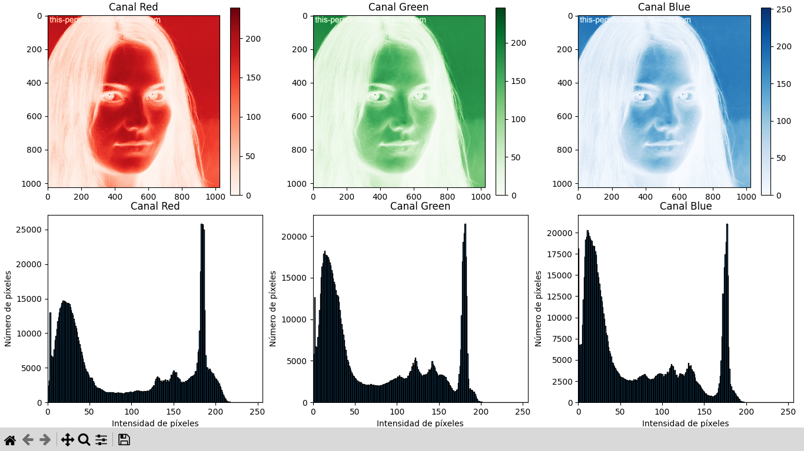
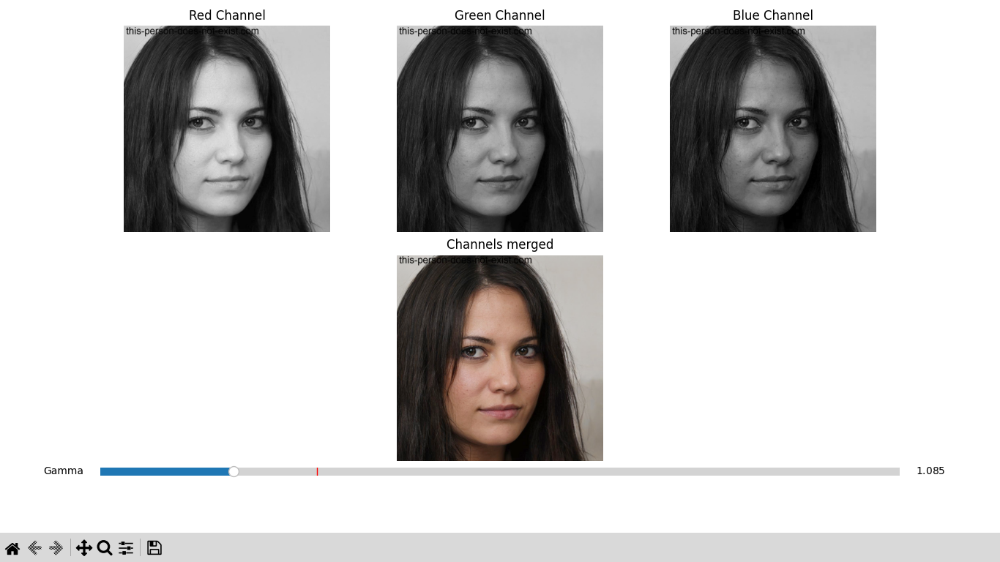
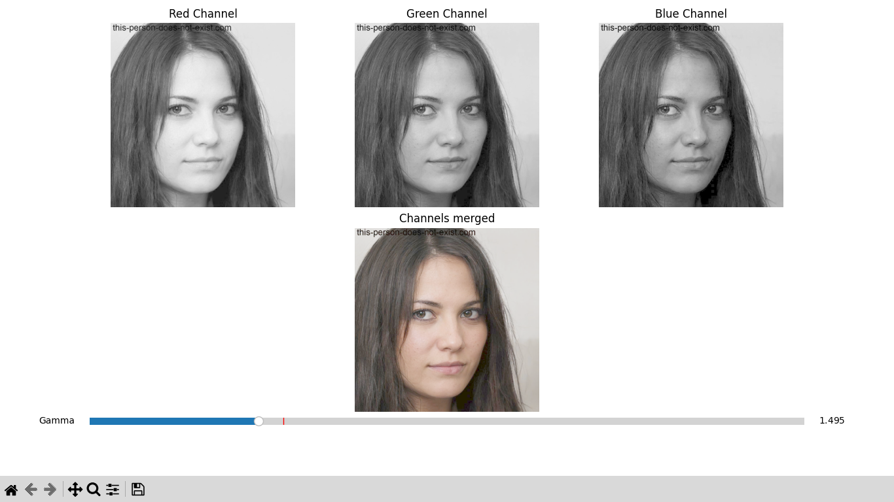
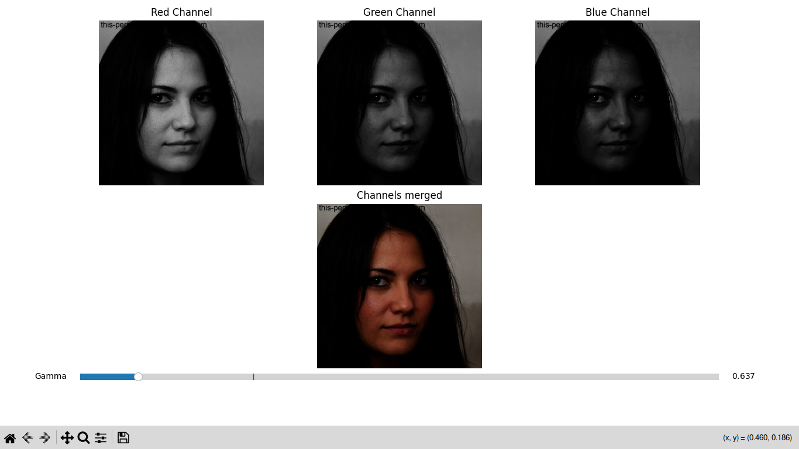
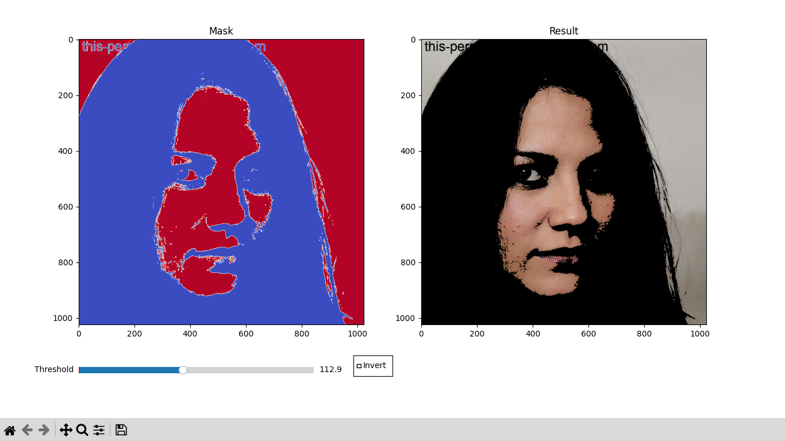
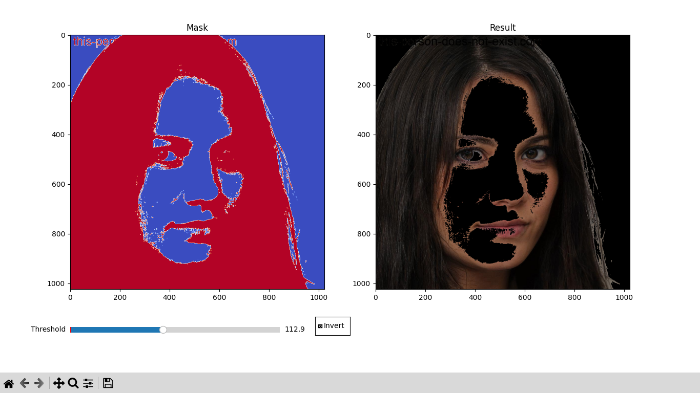
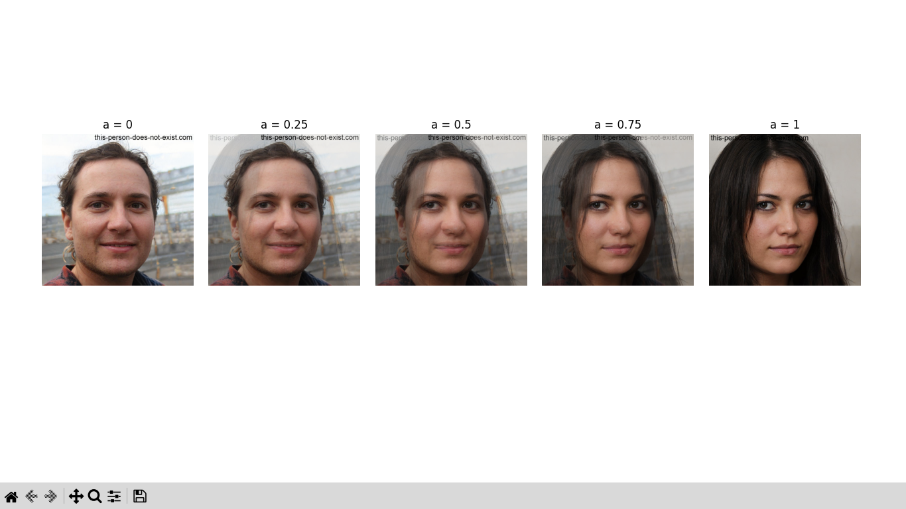
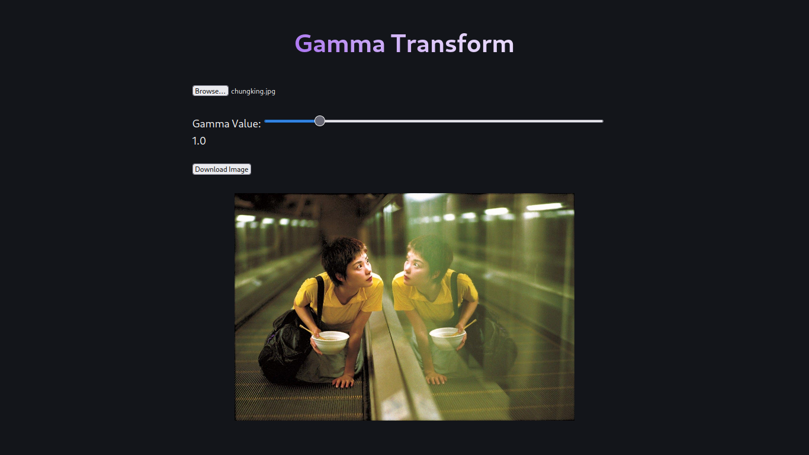
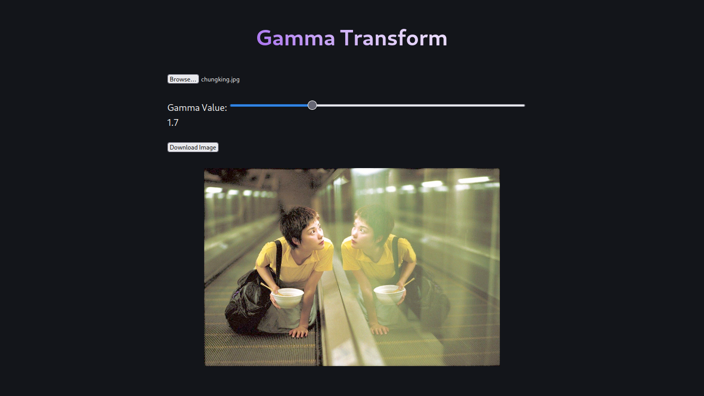
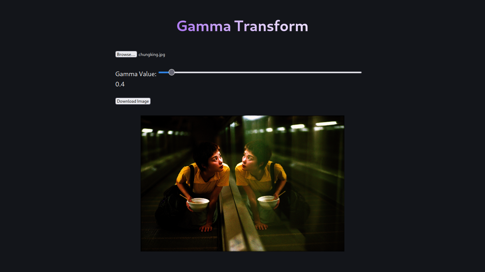

## Implementación en Python

### Histograma

### Corrección Gamma

$\gamma = 1$

$\gamma > 1$

$\gamma < 1$

### Umbralización

> Las áreas rojas son las zonas que cumplen el umbral.

Umbral mayor a 112

Umbral menor a 112 (inversa).

### Suma Ponderada

Cinco pesos diferentes.

## Implementación en Javascript

$\gamma = 1$

$\gamma > 1$

$\gamma < 1$
